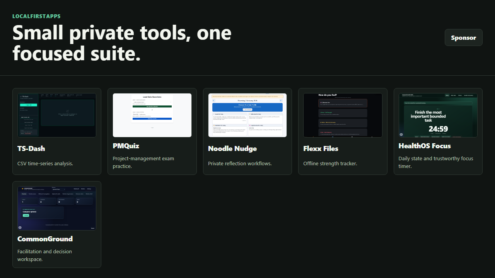

# LocalFirstApps

<p><a href="https://github.com/sponsors/shfqrkhn?o=esb"><strong>Sponsor this project</strong></a></p>

A focused suite of small, privacy-first browser apps that run as static local-first tools.

- **Live Demo:** [shfqrkhn.github.io/LocalFirstApps](https://shfqrkhn.github.io/LocalFirstApps/)
- **Repository ZIP:** [Download current main ZIP](https://github.com/shfqrkhn/LocalFirstApps/archive/refs/heads/main.zip)
- **License:** MIT
- **Runtime model:** static files, browser storage, no server-side processing
- **Maintainer handoff:** [`docs/AI_MAINTAINER_HANDOFF.md`](./docs/AI_MAINTAINER_HANDOFF.md)
- **Document authority:** [`docs/DOCUMENT_AUTHORITY.md`](./docs/DOCUMENT_AUTHORITY.md)
- **Current engineering audit:** [`docs/CODEBASE_ADVERSARIAL_AUDIT.md`](./docs/CODEBASE_ADVERSARIAL_AUDIT.md)
- **Capability/recovery matrix:** [`docs/CAPABILITY_RECOVERY_MATRIX.md`](./docs/CAPABILITY_RECOVERY_MATRIX.md)
- **Future app intake:** [`docs/future-app-intake.md`](./docs/future-app-intake.md)
- **Repository ZIP policy:** [`docs/REPO_ZIP_POLICY.md`](./docs/REPO_ZIP_POLICY.md)
- **Portable-record contract:** [`docs/INTERCHANGE_CONTRACT.md`](./docs/INTERCHANGE_CONTRACT.md)
- **PWA assurance contract:** [`docs/PWA_ASSURANCE_CONTRACT.md`](./docs/PWA_ASSURANCE_CONTRACT.md)
- **HealthOS M3A contract:** [`docs/HEALTHOS_CONTRACT.md`](./docs/HEALTHOS_CONTRACT.md)
- **CommonGround LifeOS contract:** [`docs/LIFEOS_CONTRACT.md`](./docs/LIFEOS_CONTRACT.md)

## Screenshot



## Apps

| App | Purpose | Launch |
| --- | --- | --- |
| TS-Dash | CSV-based time-series analysis | [Open](https://shfqrkhn.github.io/LocalFirstApps/apps/ts-dash/) |
| PMQuiz | Project-management certification practice | [Open](https://shfqrkhn.github.io/LocalFirstApps/apps/pmquiz/) |
| Noodle Nudge | Private reflection and self-inquiry | [Open](https://shfqrkhn.github.io/LocalFirstApps/apps/noodle-nudge/) |
| Flexx Files | Offline strength protocol tracker | [Open](https://shfqrkhn.github.io/LocalFirstApps/apps/flexx-files/) |
| HealthOS Focus | Daily-state records and trustworthy focus timing | [Open local files](./apps/healthos/) (not deployed) |
| CommonGround | Local-first facilitation and decision workspace | [Open](https://shfqrkhn.github.io/LocalFirstApps/apps/commonground/) |

## Why This Exists

These apps share the same product shape: small, static, local-first utilities with narrow workflows. Keeping them together reduces repository sprawl, makes maintenance cheaper, and gives users one clear place to find related tools.

Flagship projects remain separate:

- [ModelTab](https://github.com/shfqrkhn/ModelTab) for BYOK AI chat.
- [FIFA-WC-Sim](https://github.com/shfqrkhn/FIFA-WC-Sim) for World Cup simulation.
- [nFIRE](https://github.com/shfqrkhn/nFIRE) for financial independence planning.

## Privacy

The apps are static browser apps. Data stays in the browser unless a specific app export/import workflow is used by the user. There is no shared backend in this suite.

Cross-app integration uses explicit local files, not shared hidden storage. The versioned portable-record contract validates and previews exact selected content before any app-owned atomic import; no transfer is sent externally.

CommonGround, Flexx Files, HealthOS Focus, and Noodle Nudge share only a narrow PWA assurance contract. Each app still owns its worker, versioned content-addressed shell, data schema, caches, update controls, and reset boundary. A failed candidate cannot replace the active shell; compatible updates require explicit activation and retain one last-known-good shell.

CommonGround LifeOS `1.0.0` is the bounded shell label seeded by HealthOS Focus. Reflection remains Noodle-owned through versioned domain, state, storage, session, settings, safe-view, and binding modules. Strength links to canonical Flexx Files, whose domain and controller contracts are likewise app-owned. No shell module reads another app's storage. HealthOS records use explicit portable files, and its timestamp-reconciled timer writes a session only after user review. Meditation, breathing, C25K, and later HealthOS modules remain inactive pending separate acceptance.

CommonGround WorkOS keeps Collaboration and Decisions active over the existing
matter registry. A readable dependency-free Insights successor is verified only
as inactive, storage-free source and a test harness; it has no product route or
TS-Dash database access. The focused TS-Dash app remains canonical.

## Local Use

Download the current main repository ZIP with **Code > Download ZIP** or the direct ZIP link above, extract it, and open `index.html` in a browser. Individual apps live under `apps/<app>/`.

The launcher works from `file://`. Some individual apps use browser modules, workers, or local `fetch`, so full app and PWA behavior requires serving the folder over `http://localhost` or GitHub Pages because browsers restrict those APIs from `file://`.

```bash
python -m http.server 8080
```

## Development

R4B's readable parallel Insights successor is verified locally at `0f5b455`.
Frozen-runtime normalization, JSON round-trip, legacy database upgrade,
accessible preview, offline content-addressed loading, and the full candidate
gate pass. No Insights activation, storage, migration, route retirement, or
publication occurred. Manual assistive-technology, real quota/eviction, owner
acceptance, deployment, and publication remain `NOT_RUN`.

From a git checkout:

```bash
npm run test:local
npm run ci:candidate
npm run qa
```

`test:local` covers deterministic contracts, app behavior/recovery, content/build foundations, accessibility baselines, responsive layouts, local-file mode, and native Flexx checks. `ci:candidate` also constructs the curated `dist` artifact. `qa` additionally checks deployed Pages routes and remains a pre-publication gate.

The repository ZIP omits source-only test and package-management files where `.gitattributes` marks them `export-ignore`, so downloaded copies stay focused on running the apps.

Before adding a new module under `apps/<slug>/`, apply the intake contract in [`docs/future-app-intake.md`](./docs/future-app-intake.md).

## Migration

The original standalone repo surfaces have been retired. Canonical links, screenshots, and future development now live in this consolidated suite.

LedgerSuite decision work is now a first-class CommonGround matter type. The former suite URL temporarily redirects to CommonGround's guided migration, which validates and previews browser-local LedgerSuite data before copying it. The legacy database is never deleted automatically; LedgerSuite JSON and ZIP backups remain importable.

CommonGround also pilots the additive LocalFirstApps portable-record format. Users explicitly preview and confirm export/import, duplicate packages are rejected, and each successful import has a local rollback receipt. Existing CommonGround and LedgerSuite formats remain supported.
