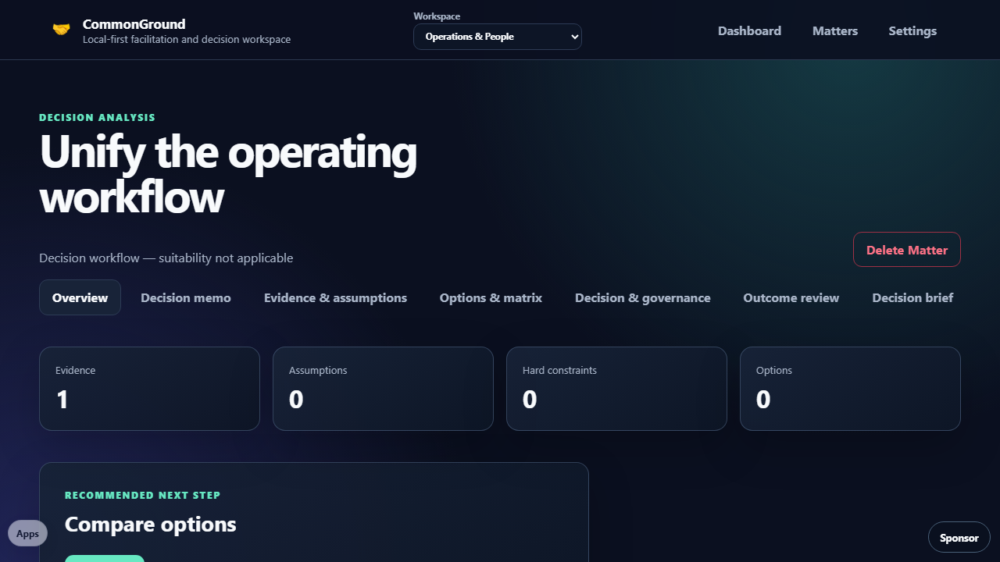

# CommonGround

<a href="https://github.com/sponsors/shfqrkhn?o=esb"><strong>Sponsor this project</strong></a>

Local-first facilitation and decision workspace.

- **Status:** Stable unified utility
- **Live Demo:** [shfqrkhn.github.io/LocalFirstApps/apps/commonground](https://shfqrkhn.github.io/LocalFirstApps/apps/commonground/)
- **Portfolio Role:** Private human-systems and accountable-decision workspace

CommonGround keeps facilitation cases and structured decision analysis in one browser-local workspace without accounts, telemetry, external provider credentials, or silent upload.

## Screenshot

## Workflows

Facilitation matter types preserve suitability screening, route-out handling, participants and consent, intake, issue mapping, sessions, commitments, follow-ups, and briefing packs.

Decision Analysis matters provide personal, professional, and shared decision contexts; decision memos; evidence; assumptions; hard constraints kept separate from comparative option scores; review matrices; governance; outcome reviews; and printable or Markdown briefs. Decision matters bypass facilitation suitability without exposing facilitation-only fields.

## Storage And Recovery

- CommonGround uses the versioned `commonground-suite` IndexedDB database.
- Its content-addressed shell stages completely before install, waits for explicit compatible activation, and retains one complete prior shell for last-known-good recovery.
- Matter and workspace backups use integrity-protected CommonGround export v2 JSON; ZIP is a stored wrapper around the same validated JSON.
- Portable-record JSON is an additional semver `1.x` option. Export and import both show exact content before confirmation; import validates SHA-256 hashes and commits new IDs plus an idempotency receipt atomically.
- CommonGround v1 matter packets and LedgerSuite JSON/ZIP schema v1/v2 remain importable.
- Same-origin LedgerSuite data can be validated, previewed, and copied atomically through guided migration. Migration is idempotent and never deletes the source automatically.
- A pre-deletion same-origin source backup includes LedgerSuite recovery logs; those operational logs are counted in the migration receipt but are not copied into decision records.
- Factory reset first downloads a complete workspace backup and clears only CommonGround-owned storage, caches, and service workers.
- Settings reports read-only browser storage/offline health and can clear only CommonGround caches without deleting workspace data. Quota, persistence, and eviction remain browser-controlled.
- Settings can roll back an applied portable-record receipt without deleting pre-existing data. The retained rolled-back receipt prevents accidental replay.
- Optional OPFS copies are best-effort; browser downloads remain the primary recovery path.
- Mutable singleton records use revision checks. If another tab saved first, CommonGround rejects the stale write and asks the user to reload instead of silently overwriting newer data. Concurrent edits to independent list items remain separate records.

## Privacy And Limits

- Static browser files only; no account, backend, provider integration, telemetry, or cloud recovery.
- Data remains on the device unless the user explicitly exports a file.
- Full module, IndexedDB migration, worker, and PWA behavior requires localhost or GitHub Pages; `file://` provides a safe explanatory fallback.
- CommonGround does not replace legal, medical, safety, mediation, governance, or other professional judgment.

## Maintenance

Runtime source is composed of readable native ES modules. Keep the matter-type registry authoritative, preserve workflow isolation, and run `npm run qa` from the repository root before publication.

## License

See `LICENSE`.
