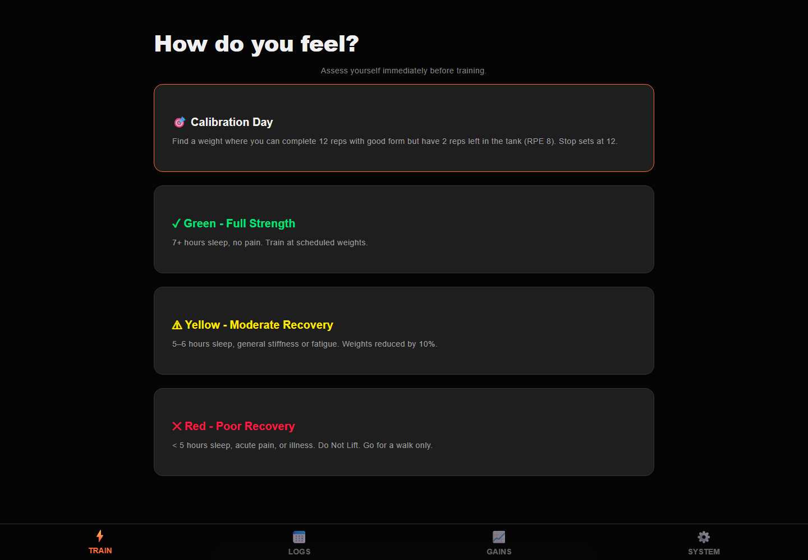

# Flexx Files

<p><a href="https://github.com/sponsors/shfqrkhn?o=esb"><strong>Sponsor this project</strong></a></p>

Offline-first strength protocol tracker.

- **Status:** Stable maintenance app
- **Version:** 3.9.74
- **Live Demo:** [shfqrkhn.github.io/LocalFirstApps/apps/flexx-files](https://shfqrkhn.github.io/LocalFirstApps/apps/flexx-files/)
- **Portfolio Role:** Fitness and personal-systems experiment.

Flexx Files is a local-first strength-training tracker focused on friction reduction, progression, plate math, rest timing, and a complete strength protocol.

## Screenshot



## Why This Exists

Training adherence improves when the tracker removes decisions instead of adding them. Flexx Files keeps the workout workflow offline, fast, and structured.

## What It Does

- Tracks protocol-based strength sessions.
- Calculates plate math and micro-loading.
- Handles rest timers, progression, stalls, and deloads.
- Runs offline as a PWA.
- Stages a content-addressed complete shell, requires explicit compatible update activation, and retains one last-known-good shell.
- Includes debug and verification support for maintenance.

## Quick Start

1. Open the live demo.
2. Start or continue the training workflow.
3. Follow the prescribed movements and timers.
4. Record work sets.
5. Let progression logic handle next-session targets.

## Privacy And Data Model

- No account or backend is required for normal use.
- Training data stays local to the browser.
- JSON backup and validated restore preserve training sessions; malformed restores fail closed.
- Factory reset downloads a complete backup first, then clears only `flexx_` data, Flexx caches, and its worker registration. Unrelated origin data is preserved.
- Settings exposes read-only quota/persistence/offline-shell health. Browser quota and eviction remain outside the app's control.

## Relationship To Other Projects

Flexx Files is the canonical HealthOS strength/readiness/progression module, while remaining a complete independent app with its own scoped storage and recovery boundary. The separate [HealthOS Focus surface](../healthos/) links here but does not read or merge Flexx data. It is not a flagship focus area unless a dedicated fitness product line becomes a priority.

## Repository Layout

```text
.
├── index.html
├── css/
├── js/
├── assets/
├── tests/
├── sw.js
└── manifest.json
```

## Deployment

Host this app folder under the LocalFirstApps GitHub Pages site or another static host.

## Maintenance

Maintenance-only unless browser compatibility, protocol correctness, or data safety requires an update.

## License

See `LICENSE`.
