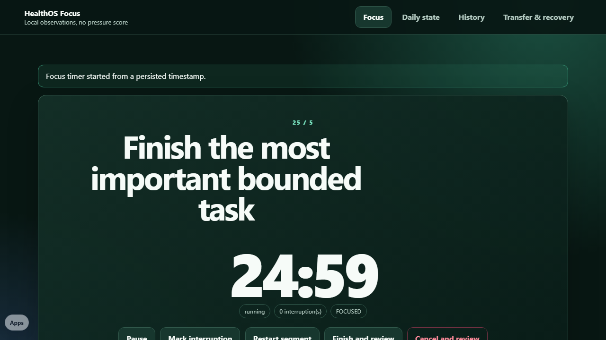

# HealthOS Focus

<a href="https://github.com/sponsors/shfqrkhn?o=esb"><strong>Sponsor this project</strong></a>

Local-first daily-state records and trustworthy focus timing.

- **Status:** M3A bounded proof
- **Version:** 0.1.0
- **Canonical route:** `https://shfqrkhn.github.io/LocalFirstApps/apps/healthos/` (not deployed; publication remains separately authorized)
- **Portfolio Role:** LifeOS → HealthOS focus module and navigation surface

HealthOS Focus links to Noodle Nudge and Flexx Files without merging their code or storage. It owns only its daily-state records, focus sessions, active timer, import receipts, preferences, PWA caches, and worker scope.

## Screenshot

## Focus contract

- Modes: 25/5, 50/10, custom, 5- or 10-minute minimum, and open stopwatch.
- Elapsed time derives from persisted instants and reconciles reload, suspension, sleep, and process termination.
- Pause, resume, restart, cancel, skip, manual correction, interruptions, and distractions are explicit.
- A completed timer writes nothing until the user reviews and confirms a typed focus-session record.
- Duplicate tabs and stale writes fail visibly; duplicate completion does not create another session.
- Audio, vibration, notifications, and screen wake lock are capability-detected and opt-in. The visible timer remains the fallback.

## Data, transfer, and recovery

- IndexedDB `healthos-focus` v1 stores M1-compatible typed `daily_state` and `focus_session` records, portable-import receipts, and the active timer.
- Daily mood, energy, sleep quality, stress, soreness, pain flags, intended focus, recovery need, and notes remain separate; there is no combined health/productivity score.
- Portable JSON requires exact preview and confirmation before atomic receipt-backed import. Applied imports can be rolled back without removing replay protection.
- Complete integrity-protected backup includes records, receipts, active timer, and cue preferences. Restore validates before atomic record replacement.
- TS-Dash CSV is explicit and deterministic, retaining units, source IDs, truth class, derivation labels, and a correlation limitation.
- Factory reset downloads a complete backup first, then clears only HealthOS-owned data, preferences, caches, and exact worker scope.

## Safety and limits

- Static local browser app; no account, backend, telemetry, external transmission, or AI dependency.
- Life-state guidance is observational, never diagnosis or treatment. It has no shame, streak, forced advancement, or productivity pressure.
- This browser timer is not a medical, emergency, or safety alarm. Real background execution, notification delivery, storage quota, and eviction remain browser-controlled.
- Full module, IndexedDB, worker, and PWA behavior requires localhost or static hosting. `file://` provides a safe reduced fallback.
- Meditation, breathing, C25K, mobility, sleep, and later HealthOS modules remain inactive pending separate acceptance.

## Maintenance

Run `npm run qa` from the repository root. Preserve Noodle Nudge and Flexx Files as independently launchable canonical modules.

## License

See `LICENSE`.
