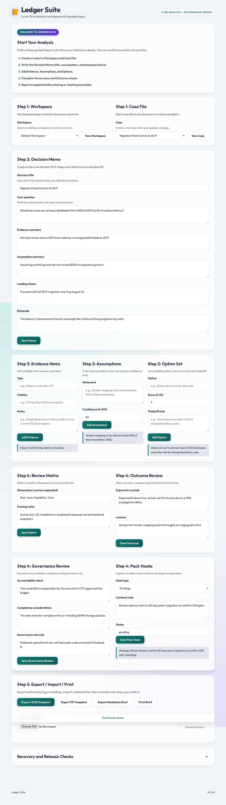

# LedgerSuite

<p><a href="https://github.com/sponsors/shfqrkhn?o=esb"><strong>Sponsor this project</strong></a></p>

Offline-first managerial judgment and operational analysis workspace.

- **Status:** Stable companion utility
- **Live Demo:** [shfqrkhn.github.io/LocalFirstApps/apps/ledgersuite](https://shfqrkhn.github.io/LocalFirstApps/apps/ledgersuite/)
- **Portfolio Role:** Operator decision-workspace utility.

LedgerSuite helps leaders and operators draft decision memos, track evidence, weigh assumptions, and prepare accountable action plans in a private browser workspace.

## Screenshot



## Why This Exists

Important operational decisions often live in scattered notes, chats, and spreadsheets. LedgerSuite provides a structured, local-first workspace for judgment, evidence, assumptions, outcomes, and review.

## What It Does

- Creates structured decision and analysis workspaces.
- Tracks evidence, assumptions, options, and governance notes.
- Supports exports, backups, and printable briefs.
- Keeps data local-first and browser-resident.
- Provides an offline-friendly PWA workflow.

## Quick Start

1. Open the live demo.
2. Create a workspace or decision memo.
3. Add evidence, assumptions, options, and tradeoffs.
4. Review outputs and next actions.
5. Export or back up the workspace before clearing browser storage.

## Privacy And Data Model

- No account or backend is required for normal use.
- Data is stored locally in the browser.
- Export/back up important work regularly.
- Sensitive business content should be handled according to the user's own security requirements.

## Relationship To Other Projects

LedgerSuite is the operator/management utility in LocalFirstApps. `CommonGround` remains a specialized facilitation companion for conflict-resolution and team-conversation workflows.

## Repository Layout

```text
.
├── index.html
├── app.js
├── styles.css
├── manifest.webmanifest
├── sw.js
└── .resources/
```

## Deployment

Host this app folder under the LocalFirstApps GitHub Pages site or another static host.

## Maintenance

Keep workflows simple, export paths obvious, and privacy guarantees accurate. Avoid adding complexity that does not improve operator reliability.

## License

See `LICENSE`.
