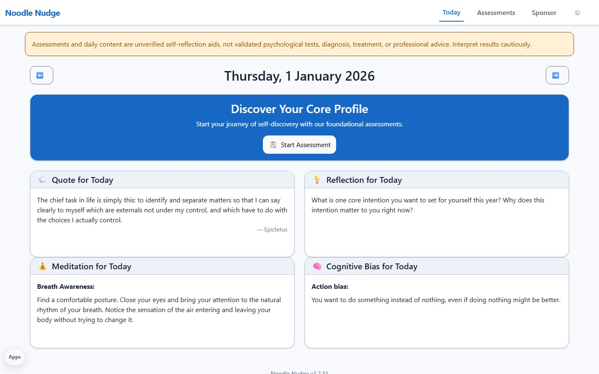

# Noodle Nudge

<p><a href="https://github.com/sponsors/shfqrkhn?o=esb"><strong>Sponsor this project</strong></a></p>

Private reflection and self-inquiry app.

- **Version:** 1.2.31
- **Status:** R3D controller modularization verified locally; canonical independent app
- **Live Demo:** [shfqrkhn.github.io/LocalFirstApps/apps/noodle-nudge](https://shfqrkhn.github.io/LocalFirstApps/apps/noodle-nudge/)
- **Portfolio Role:** Personal-growth experiment.

Noodle Nudge is a browser-based reflection tool for prompts, assessments, journaling, and self-discovery workflows.

Its assessments and daily content are unverified self-reflection aids, not validated psychological tests, diagnosis, treatment, or professional advice.

## Screenshot



## Why This Exists

Reflection tools are most useful when they are private, simple, and available when needed. Noodle Nudge keeps the user in a local-first environment instead of a social or cloud workflow.

## What It Does

- Provides daily reflection prompts.
- Includes self-assessment workflows.
- Supports private journaling and self-inquiry.
- Runs as a static app from GitHub Pages.
- Emphasizes local privacy.
- Evaluates canonical assessment formulas with a bounded allowlisted interpreter; assessment content is never executable code.
- Exposes the ten canonical definitions and 42-rule scorer through a versioned Noodle-owned Reflection adapter without granting LifeOS data access.
- Uses app-owned state, transactional storage, content, assessment-session, settings/recovery, safe-view/chart, and lifecycle/DOM modules behind nine explicit compatibility bindings.
- Starts a complete JSON backup before reset, atomically restores validated legacy/current backups, and refreshes committed results from another tab without interrupting an active assessment.
- Stages a content-addressed complete offline shell, requires explicit compatible activation, and retains a last-known-good shell without touching sibling app caches.

## Quick Start

1. Open the live demo.
2. Start with the daily prompt.
3. Use assessments when useful.
4. Record reflections locally.
5. Back up any data you need before clearing browser storage.

## Privacy And Data Model

- No account or backend is required for normal use.
- Personal reflections should stay local unless the user chooses to export or share them.
- This app is not medical care, crisis support, or therapy.

## Relationship To Other Projects

Noodle Nudge is the canonical HealthOS reflection and self-inquiry module, while remaining a complete independent app with its own IndexedDB data and recovery boundary. The separate [HealthOS Focus surface](../healthos/) links here but does not read or merge Noodle Nudge storage. It is intentionally not part of the active flagship set so maintenance energy stays focused.

## Repository Layout

```text
.
├── index.html
├── app.js
├── styles.css
├── controller/
├── icons/
├── images/
├── JSON/
├── manifest.json
├── pwa-shell.json
├── reflection/
├── reflection-adapter.js
├── scoring.js
├── service-worker.js
└── README.md
```

## Deployment

Host this app folder under the LocalFirstApps GitHub Pages site or another static host.

## Maintenance

Preserve the independent route, `NoodleNudgeDB` v1 store/key and records, nine runtime/export fields, seven persisted fields, UI, backup shape, worker scope, nine-name compatibility facade, and compatibility `scoring.js` URL. See the [Reflection contract](../../docs/REFLECTION_CONTRACT.md). Structural/scoring validation is not content approval.

## License

See `LICENSE`.
