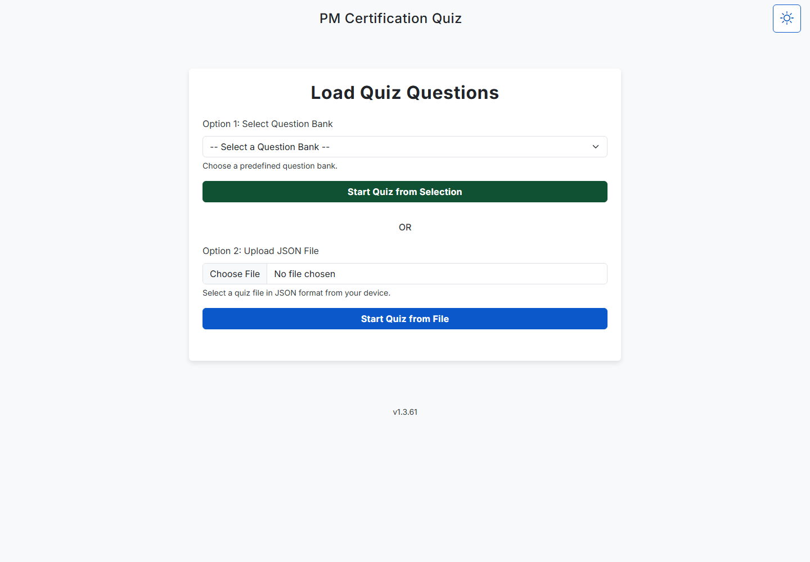

# PMQuiz

<p><a href="https://github.com/sponsors/shfqrkhn?o=esb"><strong>Sponsor this project</strong></a></p>

Offline-capable project-management certification practice app.

- **Status:** Stable maintenance app
- **Live Demo:** [shfqrkhn.github.io/LocalFirstApps/apps/pmquiz](https://shfqrkhn.github.io/LocalFirstApps/apps/pmquiz/)
- **Portfolio Role:** Education utility.

PMQuiz is a free PWA for project-management certification practice, with question banks, timed quiz flow, instant feedback, and review mode.

## Screenshot



## Why This Exists

Exam preparation works best when practice is fast, repeatable, and available offline. PMQuiz keeps that workflow simple and local.

## What It Does

- Provides question banks for project-management certification practice.
- Supports timed sessions.
- Shows immediate feedback and explanations.
- Includes review mode.
- Supports custom JSON question files.
- Runs offline after initial load.

## Quick Start

1. Open the live demo.
2. Select a question bank.
3. Start a quiz.
4. Answer before time expires.
5. Review the final score and explanations.
6. Optionally upload a compatible custom JSON question file.

## Privacy And Data Model

- No account or backend is required for normal use.
- Quiz state and uploaded custom files stay in the browser.
- Custom question-file uploads are user-triggered and read locally for the active quiz.
- PMQuiz does not provide a separate cloud backup, account recovery, or export workflow for quiz progress; use **Reset Quiz & Load New** to clear the current session.
- No tracking or cookies are required by the app.

## Relationship To Other Projects

PMQuiz is a stable education utility. It is not one of the flagship projects, but it remains useful as a focused, low-maintenance app.

## Repository Layout

```text
.
├── index.html
├── app.js
├── style.css
├── QuestionBanks/
├── json-worker.js
├── service-worker.js
└── manifest.webmanifest
```

## Deployment

Host this app folder under the LocalFirstApps GitHub Pages site or another static host.

## Maintenance

Maintenance-only unless question banks, compatibility, or browser APIs need updates.

## License

See `LICENSE`.
