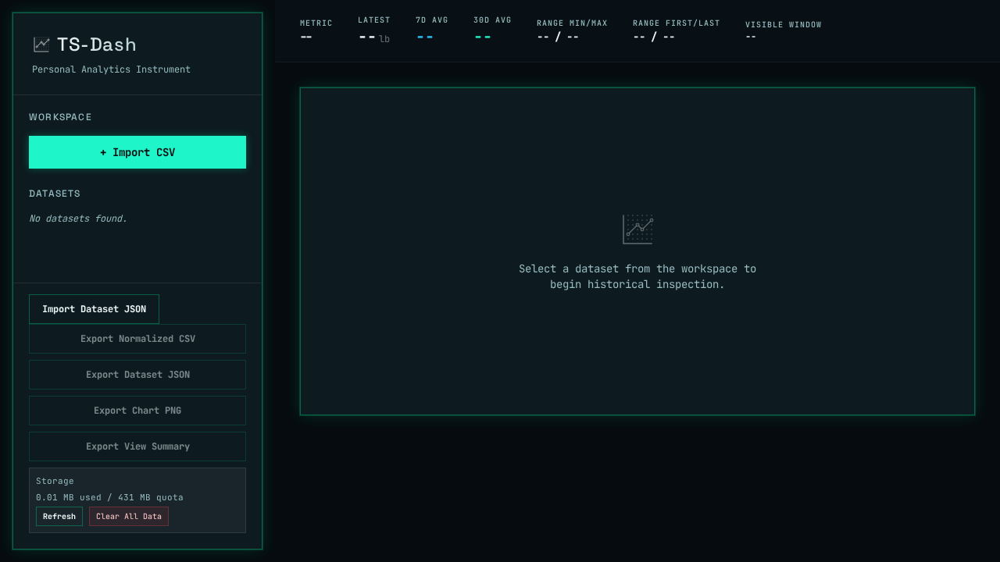

# TS-Dash

<p><a href="https://github.com/sponsors/shfqrkhn?o=esb"><strong>Sponsor this project</strong></a></p>

Privacy-first local time-series dashboard for CSV data.

- **Status:** Stable companion utility
- **Live Demo:** [shfqrkhn.github.io/LocalFirstApps/apps/ts-dash](https://shfqrkhn.github.io/LocalFirstApps/apps/ts-dash/)
- **Portfolio Role:** Reusable data-dashboard utility supporting the finance/data lane.

TS-Dash imports CSV-based personal or operational metrics and provides a local browser dashboard for inspection, milestones, visible-range analysis, and tabular fallback.

## Screenshot



## Why This Exists

Small personal datasets often need quick, private inspection without a cloud account or heavyweight BI stack. TS-Dash keeps the workflow local and focused.

## What It Does

- Imports CSV files through a guided mapping wizard.
- Visualizes one primary metric with zoom/pan and time presets.
- Shows milestone markers, insights, and visible-range tables.
- Supports deterministic probes, comparisons, thresholds, and recurrence checks.
- Stores data locally in the browser.

## Quick Start

1. Open the live demo.
2. Select Import CSV.
3. Map timestamp and value columns.
4. Confirm import.
5. Use time presets, hover inspection, milestones, insights, and tables.

## Privacy And Data Model

- CSV data stays in the browser.
- No account or backend is required for normal use.
- Export or preserve source CSV files before clearing browser storage.

## Relationship To Other Projects

TS-Dash remains a stable utility. Financial solvency planning belongs in `nFIRE`; general data-dashboard ideas can be reused here only when they keep the tool simple.

## Repository Layout

```text
.
├── index.html
├── assets/
├── manifest.webmanifest
├── sw.js
└── screenshot.png
```

## Deployment

Host this app folder under the LocalFirstApps GitHub Pages site or another static host.

## Maintenance

Keep imports predictable, analysis deterministic, and UI focused on one clear metric workflow.

## License

See `LICENSE`.
